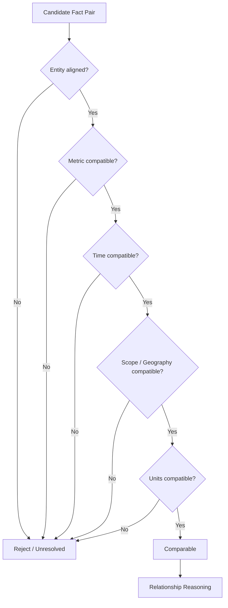
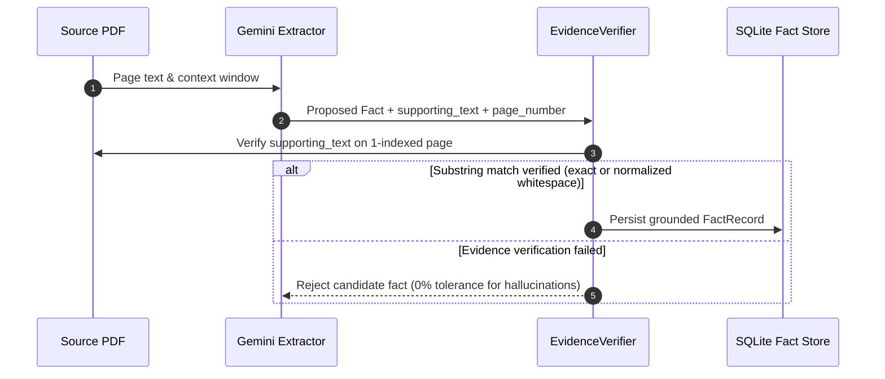
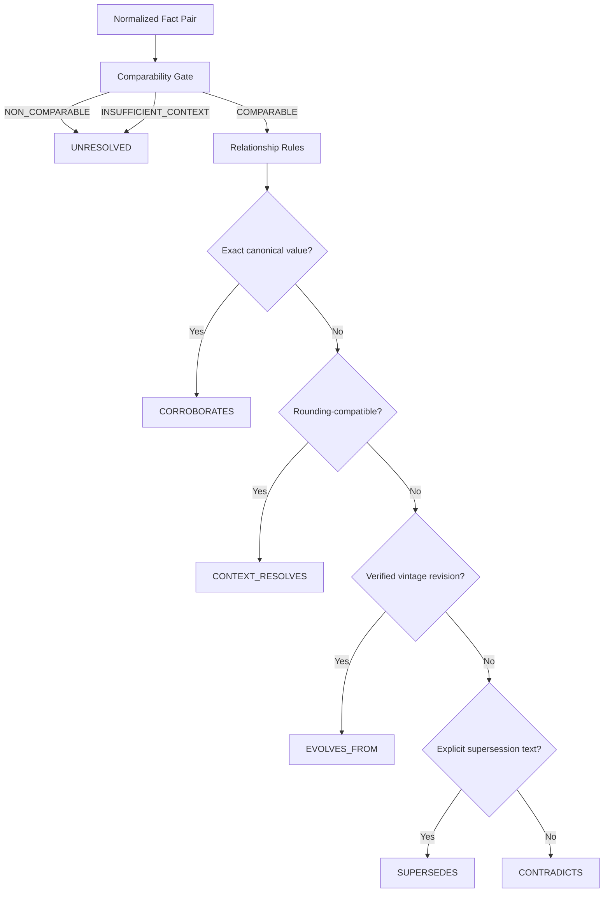

# FACTLINE
## Evidence-First Cross-Document Fact Intelligence

> **Core Architectural Principle:** Never compare two values before establishing that the claims are comparable.

FACTLINE extracts structured facts from dense financial and economic PDF reports, binds every claim to verified page-level evidence, normalizes numerical dimensions deterministically, and compares claims only after strictly establishing comparability across entity, metric, temporal, scope, and unit boundaries.

---

## 1. The Problem

Financial, corporate, and governmental PDF reports contain numerical and semantic claims that frequently look comparable on the surface but differ across critical contextual dimensions:

* **Unit & Scale**: Millions vs. Crores vs. Billions vs. USD/INR.
* **Temporal Granularity**: Annual full-year (FY24) vs. fourth-quarter (Q4 FY24) vs. year-to-date.
* **Scope & Entity Definition**: Standalone vs. Consolidated, group-level vs. division-level.
* **Geographic Boundaries**: Domestic operations vs. Global total.
* **Data Vintage**: First Advance Estimate vs. Second Advance Estimate vs. Provisional Actuals.
* **Epistemic Status**: Audited actuals vs. management targets vs. statistical projections.
* **Reporting Context**: Gross vs. Net figures, rounded presentation figures vs. exact statutory disclosures.

A naive retrieval or LLM comparison system observes two proximate numbers such as:

```text
6.4% (First Advance Estimate)
6.5% (Second Advance Estimate)
```

and immediately flags them as a **factual contradiction**. 

FACTLINE enforces a strict separation: it first evaluates **"Are these claims about the same underlying thing?"** across all contextual dimensions before attempting any numerical or semantic comparison.

---

## 2. What FACTLINE Does

FACTLINE executes a multi-stage, auditable fact-intelligence pipeline:


1. **Page-Aware PDF Parsing**: Extracts text while retaining strict 1-indexed page boundaries and document hashes.
2. **Relevance Filtering & Context Selection**: Identifies informative factual pages and applies surrounding context windows.
3. **Quota-Aware Semantic Extraction**: Gemini 3.6 Flash extracts candidate facts matching a strict JSON schema in 5-page batches.
4. **Deterministic Evidence Verification**: Verifies that the LLM's proposed `supporting_text` exists verbatim on the source page. Ungrounded facts are rejected immediately.
5. **Deterministic Normalization**: Normalizes numerical values, scales (crores, millions, billions), currencies, percentages, and ISO time ranges in Python.
6. **Candidate Matching**: Identifies candidate pairs using conservative deterministic heuristics (no unbounded $O(N^2)$ LLM calls).
7. **Comparability Gate**: Evaluates whether two facts are genuinely comparable across 8 explicit dimensions.
8. **Relationship Engine**: Classifies relationships (`CORROBORATES`, `CONTRADICTS`, `CONTEXT_RESOLVES`, `EVOLVES_FROM`, `SUPERSEDES`, `UNRESOLVED`) using deterministic rules and mathematical rounding reconciliation.
9. **Relationship Surfacing Filter**: Suppresses cross-metric noise and self-pairs.
10. **Atomic Persistence & Evidence-First UI**: Persists all documents, facts, relationships, and execution summaries to SQLite for dense visual inspection.

---

## 3. Why This Is Not Just RAG

Retrieval-Augmented Generation (RAG) is designed for semantic search and conversational question-answering. However, standard RAG suffers from fundamental flaws when applied to cross-document numerical verification:

* **Retrieval $\neq$ Comparability**: Vector proximity or keyword match does not determine whether two numbers share identical units, time intervals, or accounting scopes.
* **Probabilistic Comparison Flaws**: LLMs struggle with multi-scale arithmetic (e.g., comparing ₹8,142 crore with ₹81,415.38 million) and often hallucinate contradictions due to rounding differences.
* **Loss of Temporal & Vintage Context**: RAG chunks often strip the header metadata that distinguishes a *First Advance Estimate* from a *Revised Estimate*.
* **Hallucinated Provenance**: Generative answers frequently cite page numbers or quotes that do not exist or combine disparate sentences.

FACTLINE is **not a chatbot**. It is a **structured fact-reasoning pipeline** that treats extracted claims as first-class, provenance-backed objects and evaluates comparability deterministically.

---

## 4. Core Design Principle

> **Never compare two values before establishing that the claims are comparable.**



If any contextual dimension is incompatible or missing, FACTLINE abstains from value comparison rather than guessing or fabricating a contradiction.

---

## 5. LLM vs. Deterministic Logic

FACTLINE maintains a strict boundary between probabilistic extraction and deterministic evaluation:

| Responsibility | LLM (Gemini 3.6 Flash) | Deterministic Code (Python) | Rationale |
| :--- | :---: | :---: | :--- |
| **Semantic Fact Extraction** | ✓ | | Interprets unstructured narrative sentences, financial tables, and footnotes. |
| **Entity & Metric Discovery** | ✓ | | Identifies implicit subject entities and financial metric descriptions. |
| **Epistemic Status Extraction** | ✓ | | Classifies language modality (*audited*, *projected*, *target*, *estimated*). |
| **Supporting Text Proposal** | ✓ | | Identifies the exact excerpt justifying the claim. |
| **Evidence Grounding Verification** | | ✓ | Validates exact substring match against authoritative PDF page text. |
| **Numeric & Unit Normalization** | | ✓ | Computes standard units and base-10 scale multipliers without LLM math errors. |
| **Date & Interval Normalization** | | ✓ | Parses fiscal and calendar periods into ISO 8601 interval bounds. |
| **Candidate Pairing** | | ✓ | Groups facts using conservative deterministic keys. |
| **Comparability Gating** | | ✓ | Evaluates multi-dimensional compatibility rules. |
| **Relationship Classification** | | ✓ | Applies locked rule hierarchy and vintage transitions. |
| **Rounding Reconciliation** | | ✓ | Computes exact display resolution bounds ($\Delta_{\max} = 0.5 \times \max(R_A, R_B)$). |
| **Persistence & Transactions** | | ✓ | Manages atomic SQLite operations with referential integrity. |

---

## 6. Provenance & Evidence Model

Every fact extracted by FACTLINE must possess verifiable provenance. Source PDFs remain the single source of truth.



### Provenance Fields
* `document_id`: Deterministic hash of document name and content.
* `page_number`: 1-indexed source PDF page.
* `supporting_text`: Verbatim text snippet from the page.
* `document_date`: Publication or period date where available.

---

## 7. Structured Fact Model

Facts are modeled as immutable `FactRecord` objects with dual representations:

```python
class FactRecord(BaseModel):
    fact_id: str                      # Deterministic hash: doc_id + page + entity + metric + raw_val
    entity: str                       # e.g., "Delhivery Limited"
    metric: str                       # e.g., "Revenue from operations"
    value_raw: str                    # e.g., "₹8,142 Cr", ">33,200"
    value_numeric: Optional[float]    # e.g., 8142.0
    unit: Optional[str]               # e.g., "Cr", "million", "%"
    time_period: TimePeriod           # label, start_date, end_date
    scope: Optional[str]              # e.g., "Consolidated", "Standalone"
    geography: Optional[str]          # e.g., "India", "Global"
    epistemic_status: EpistemicStatus # REPORTED, ESTIMATED, PROJECTED, TARGET, AUDITED
    data_vintage: Optional[str]       # e.g., "First Advance Estimate", "Q4 FY24 Presentation"
    provenance: Provenance            # doc_id, page_number, supporting_text, document_date
    extraction_confidence: float      # Model-assigned extraction confidence
```

---

## 8. Deterministic Normalization

FACTLINE converts heterogeneous reporting conventions into canonical representations:

### Monetary Scales & Units
* `₹8,142 Cr` $\rightarrow$ `81,420,000,000 INR` (scale: `crore`, multiplier: $10^7$)
* `₹81,415.38 million` $\rightarrow$ `81,415,380,000 INR` (scale: `million`, multiplier: $10^6$)
* `$4.2 billion` $\rightarrow$ `4,200,000,000 USD` (scale: `billion`, multiplier: $10^9$)

### Safe Ambiguity Rules
1. **No Speculative Currencies**: Bare `$` without geographical or document context is not assumed to be `USD`.
2. **No Invented Date Intervals**: Bare `"FY24"` is preserved as a label but not assigned calendar dates unless fiscal calendar bounds are verified.
3. **Preservation of Qualifiers**: `>33,200` preserves qualifier `>` and raw string `">33,200"` alongside numeric `33200.0`.
4. **Rounding Handling**: Normalization preserves exact raw values; rounding reconciliation is performed during relationship reasoning, not by mutating raw numbers.

---

## 9. Candidate Matching

To avoid $O(N^2)$ combinatorial explosion across multi-document corpora, `CandidateMatcher` uses conservative deterministic signals:
* Exact or normalized entity alignment.
* Shared canonical metric stems or explicit keyword overlap.
* Cross-document pairing filter (same-document duplicate pairing suppressed).

Candidate generation discovers pairs for evaluation; **it does not imply comparability or semantic equivalence**.

---

## 10. Comparability Gate

The `ComparabilityGate` evaluates candidate pairs across 8 dimensions before any value comparison occurs:

```text
Status: COMPARABLE | NON_COMPARABLE | INSUFFICIENT_CONTEXT
```

* **Entity**: Must refer to the same corporate or macroeconomic entity.
* **Metric**: Canonical metrics must align without semantic conflation.
* **Unit & Currency**: Units must be dimensionally compatible (e.g., currency to currency).
* **Time Period**: Start and end date bounds must match. Sub-periods (e.g., `FY24` vs `Q4 FY24`) are flagged `NON_COMPARABLE` (`TIME_MISMATCH`).
* **Scope**: Consolidated vs. Standalone operations must match.
* **Geography**: Geographic scopes must align.
* **Abstention on Missing Context**: If either fact lacks crucial scope or temporal metadata, the gate returns `INSUFFICIENT_CONTEXT` rather than guessing.

---

## 11. Relationship Engine

When a pair is declared `COMPARABLE`, the `RelationshipEngine` evaluates the claims through a locked rule hierarchy:



### Mathematical Rounding Resolution (`CONTEXT_RESOLVES`)
When two sources report slightly different numbers due to differing display scales, FACTLINE computes the display resolution:
* Fact A: `₹8,142 crore` (0 decimals in crore scale $\rightarrow R_A = 1 \times 10,000,000 = 10,000,000\text{ INR}$).
* Fact B: `₹81,415.38 million` (2 decimals in million scale $\rightarrow R_B = 0.01 \times 1,000,000 = 10,000\text{ INR}$).
* Maximum allowable rounding tolerance: $\Delta_{\max} = 0.5 \times \max(R_A, R_B) = 5,000,000\text{ INR}$.
* Absolute difference: $|81,420,000,000 - 81,415,380,000| = 4,620,000\text{ INR}$.
* Since $4,620,000 \le 5,000,000$, the relationship is classified as `CONTEXT_RESOLVES` (rounding reconciliation).

---

## 12. Relationship Surfacing Filter

Candidate matching can discover facts that pass broad pairing heuristics but do not represent meaningful relationships. The `RelationshipSurfacingFilter` executes after the gate to suppress noise:
* Suppresses cross-metric pairings lacking explicit comparative language.
* Suppresses duplicate self-pairs.
* Suppresses weak candidates with unresolved dimensions.

---

## 13. Extraction Efficiency & Concurrency

To handle dense multi-page financial reports efficiently within API quota constraints:


* **Page Relevance Scoring**: Filters out blank, boilerplate, or legal disclosure pages.
* **Context Selection**: Attaches surrounding page context (radius = 2) to preserve multi-page table headers.
* **Multi-Page Batching**: Groups 5 pages per API call to minimize round trips.
* **Bounded Concurrency**: Bounded 2-worker concurrent execution for optimal throughput without hitting rate limits.
* **Quota-Aware Planner**: Computes request budgets before dispatching extraction calls.

---

## 14. Failure Handling & Resilience

FACTLINE enforces strict failure semantics across all execution stages:

* **HTTP 429 (Rate Limit)**: Immediately halts further external calls and transitions to `PARTIAL_QUOTA` or `QUOTA_EXHAUSTED`.
* **HTTP 503 (Unavailable)**: Executes bounded exponential backoff retries.
* **Malformed Model JSON**: Rejects the batch without crashing the worker.
* **Evidence Grounding Failure**: Individual ungrounded facts are dropped; valid facts from the same batch are preserved.
* **Partial Persistence Invariant**: All facts verified prior to a failure or quota limit are atomically persisted to SQLite.

---

## 15. Persistence Architecture

FACTLINE persists all data to an embedded SQLite database (`factline.db`):

* `documents`: Document ID (SHA256 hash), document name, content hash, total pages, created timestamp.
* `facts`: Fact ID, document ID, raw values, numeric values, canonical values, units, epistemic status, vintage, 1-indexed page number, verbatim supporting text.
* `relationships`: Relationship ID, fact A ID, fact B ID, relationship type, reason codes, explanation, confidence, dual evidence.
* `analyses`: Analysis ID (UUID), timestamp, document IDs, summary metrics, execution status.

---

## 16. API Endpoints

The FastAPI backend exposes the following REST endpoints:

* `GET /health`: Health check and system readiness status.
* `POST /documents/parse`: Parses an uploaded PDF into 1-indexed page text records.
* `POST /documents/extract-facts`: Parses a PDF and extracts grounded `FactRecord` objects.
* `POST /reason/relationship`: Evaluates comparability and relationship between two normalized facts.
* `POST /analysis`: Orchestrates end-to-end multi-document parsing, extraction, normalization, matching, comparability gating, relationship evaluation, and persistence.
* `GET /analysis/{analysis_id}`: Retrieves complete stored analysis results, facts, and relationship graphs.
* `GET /`: API root metadata and documentation link.

---

## 17. Evidence-First User Interface

The React + Vite frontend is designed specifically for dense factual inspection:

```text
Upload Documents → Processing & Quota Status → Fact Inspection → Relationship Matrix → Grounded Evidence Viewer
```

* **Interactive Relationship Matrix**: Highlights corroborations, contradictions, evolutions, and rounding resolutions.
* **Dual Provenance Inspector**: Side-by-side display of exact source excerpts and 1-indexed page numbers.
* **Audit Metadata**: Displays display resolution tolerances, normalization warnings, and comparability reason codes.

---

## 18. Verified Golden Cases

FACTLINE has been verified against canonical test cases:

### Case 1: Multi-Scale Rounding Reconciliation (`CONTEXT_RESOLVES`)
* **Fact A**: Delhivery FY24 Revenue from Operations = `₹81,415.38 million` (*Annual Report*, PDF p. 22 / printed report p. 43).
* **Fact B**: Delhivery FY24 Revenue from Operations = `₹8,142 Cr` (*Earnings Presentation*, PDF p. 6 / slide 5).
* **Evaluation**: Comparability Gate $\rightarrow$ `COMPARABLE`. Relationship Engine calculates $\Delta = 4.62\text{M} \le \Delta_{\max} = 5.0\text{M}$.
* **Result**: `CONTEXT_RESOLVES` (deterministic rounding reconciliation).

### Case 2: Macroeconomic Vintage Evolution (`EVOLVES_FROM`)
* **Fact A**: India FY25 GDP Growth = `6.4%` (*First Advance Estimate*, PDF p. 4).
* **Fact B**: India FY25 GDP Growth = `6.5%` (*Second Advance Estimate*, PDF p. 6).
* **Evaluation**: Comparability Gate $\rightarrow$ `COMPARABLE` with distinct data vintages.
* **Result**: `EVOLVES_FROM` (official statistical revision).

### Case 3: Temporal & Scope Granularity Mismatch (`UNRESOLVED` / Non-Comparable)
* **Fact A**: Delhivery Active Customers = `>33,200` (*Annual Report*, PDF p. 2, annual figure).
* **Fact B**: Delhivery Active Customers = `33,278` (*Earnings Presentation*, PDF p. 4, Q4 figure).
* **Evaluation**: Comparability Gate flags `TIME_MISMATCH` (Annual vs. Quarterly) and `SCOPE_MISMATCH`.
* **Result**: `UNRESOLVED` (abstains from false contradiction).

### Case 4: Quota Interruption with Fact Retention (`PARTIAL_QUOTA`)
* Simulated API quota limit mid-document.
* **Result**: Pipeline transitions cleanly to `PARTIAL_QUOTA`, returns execution diagnostic summary, and preserves all verified facts in SQLite.

---

## 19. Held-Out PDF Generalization Test

FACTLINE was evaluated against a large, complex official report:
* **Document**: `03-imf-india-2025-article-iv-excerpt.pdf` (95 total pages, 90 eligible content pages).
* **Execution**: Bounded 30-page processing with 2-worker concurrency.
* **Outcome**: 77 verified facts extracted across macroeconomic indicators, inflation figures, and debt ratios.
* **Grounding Accuracy**: 0 evidence grounding rejections (100% of persisted facts verified verbatim).
* **Status**: Clean `PARTIAL_QUOTA` completion with zero unhandled exceptions.

---

## 20. Alternative Provider Benchmark (Groq Experiment)

To assess provider portability, an isolated benchmark was conducted in `backend/groq_experiment/` comparing Gemini 3.6 Flash against Groq (`openai/gpt-oss-120b`) across an identical 25-page content-diverse corpus (5 batches, 1 worker, identical prompt and schema):

| Metric | Google Gemini 3.6 Flash (Production) | Groq `openai/gpt-oss-120b` (Experimental) |
| :--- | :---: | :---: |
| **Successful Batches** | **5 / 5 (100%)** | 1 / 5 (20%) |
| **Raw Facts Extracted** | **48** | 2 |
| **Verified Grounded Facts** | **48** | 1 |
| **Evidence Grounding Rate** | **100%** | 50% (1/2 facts) |
| **Schema Validation Errors** | **0** | 2 (HTTP 400 schema validation failures) |
| **Rate Limit Failures** | **0** | 2 (HTTP 429 8,000 TPM limit exceeded) |

**Conclusion**: Gemini 3.6 Flash remains the sole production provider due to strict JSON compliance and reliable throughput. Groq remains an isolated experimental benchmark.

---

## 21. Limitations

* **Irregular & Borderless PDF Tables**: Highly complex multi-column tables without visual borders may have degraded text extraction from standard PDF parsers.
* **Multi-Step Deductive Arithmetic**: FACTLINE extracts stated figures and normalizes scales; it does not perform multi-step financial accounting reconciliations across disparate financial statements.
* **Cross-Document Entity Disambiguation**: Entities with completely different legal names across documents require explicit canonical mapping rules.
* **API Quota Constraints**: Provider rate limits govern processing speed for very large document collections.

---

## 22. Quick-Start & Installation

### Prerequisites
* Python 3.11+
* Node.js 18+
* Gemini API Key

### 1. Clone & Configure Environment
```bash
git clone https://github.com/VaishnavSreekumar/FACTLINE.git
cd FACTLINE

cp .env.example .env
# Edit .env and set GEMINI_API_KEY=your_api_key_here
```

### 2. Backend Setup & Test Suite
```bash
# Create and activate virtual environment
python -m venv venv
# On Windows:
.\venv\Scripts\activate
# On Linux/macOS:
source venv/bin/activate

# Install dependencies
pip install -r requirements.txt

# Run complete test suite (278 passing unit & integration tests)
pytest backend/tests/ -v

# Start FastAPI backend server
python -m uvicorn backend.main:app --host 127.0.0.1 --port 8000 --reload
```

### 3. Frontend Setup
```bash
# In a separate terminal:
cd frontend
npm install

# Validate production build
npm run build

# Start Vite development server
npm run dev
```
Open `http://localhost:5173` in your browser to interact with the FACTLINE interface.

---

## 23. Detailed Technical Architecture

For an in-depth technical breakdown of data contracts, mathematical rounding formulas, concurrency design, comparability gate reason codes, and engineering trade-offs, refer to the full architecture document:

👉 **[FACTLINE Technical Architecture Document](docs/architecture.md)**
