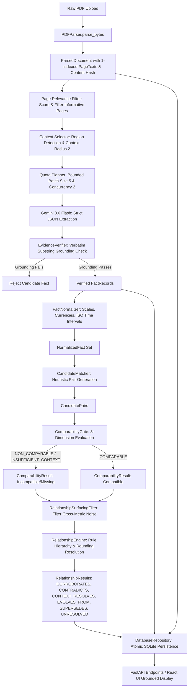
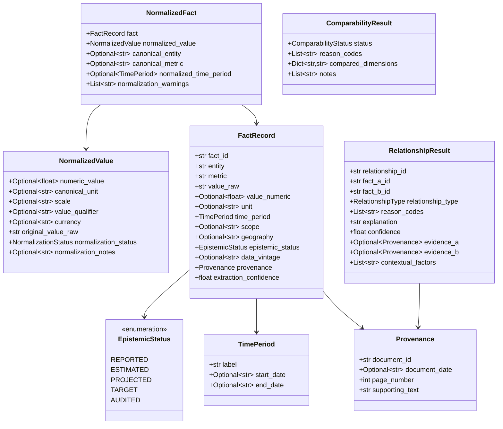
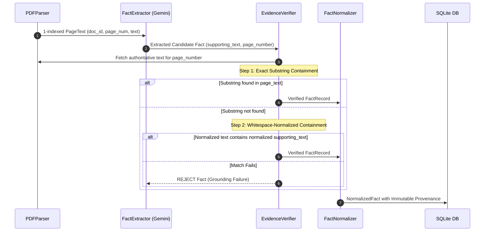
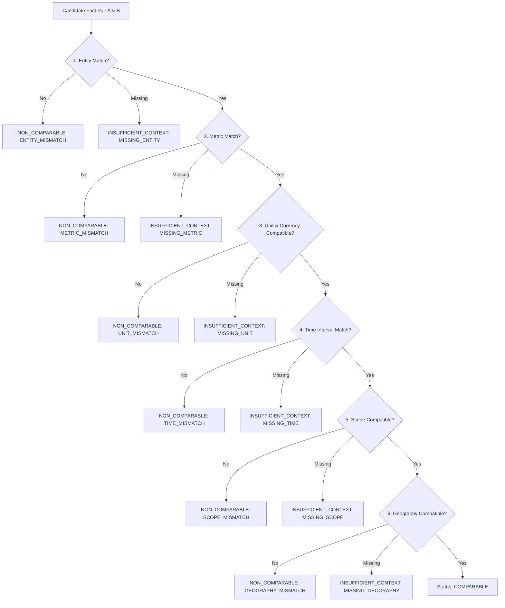
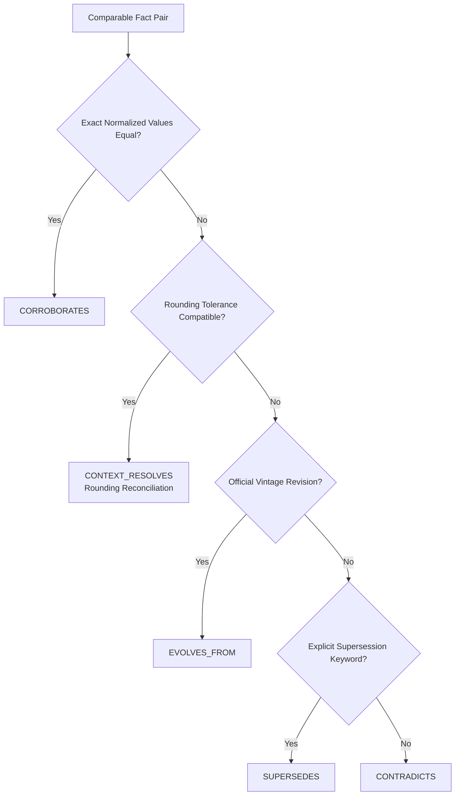
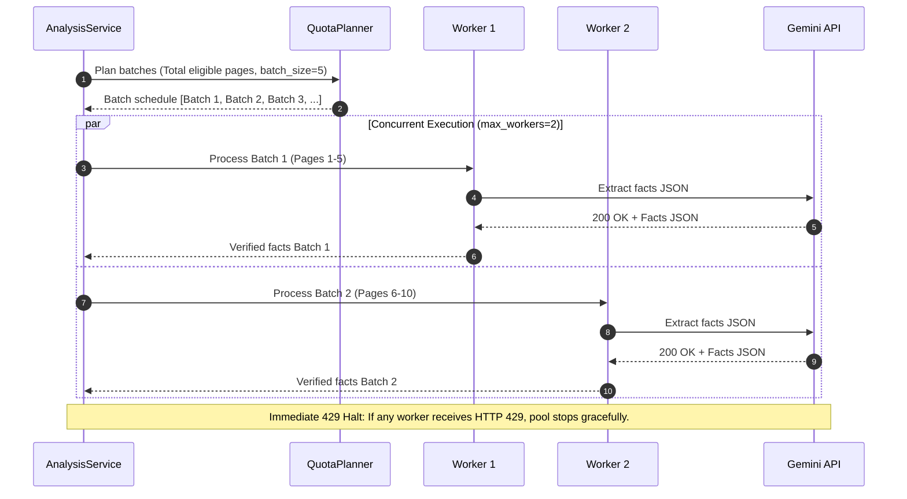

# FACTLINE — Technical Architecture

> FACTLINE is an evidence-first cross-document fact intelligence pipeline. Its central architectural constraint is that numerical or semantic relationships are evaluated only after the system has established that the underlying claims are comparable.

---

## A. Architectural Principles

1. **Evidence Before Reasoning**: No claim enters the reasoning pipeline without exact, verbatim substring grounding on a 1-indexed source PDF page. Source documents remain the sole authoritative ground truth.
2. **Comparability Before Numerical Comparison**: Never compare two numerical or semantic values before establishing that the claims represent the same underlying entity, metric, temporal interval, accounting scope, and unit dimension.
3. **Deterministic Logic for Deterministic Transformations**: Unit conversions, currency scaling, percentage calculations, date range parsing, candidate matching, comparability gating, rounding reconciliation, and persistence must be executed by deterministic Python code, never delegated to probabilistic LLM generation.
4. **Abstention Over Unsupported Inference**: When essential context (scope, time bounds, geography) is ambiguous or missing, the system emits `INSUFFICIENT_CONTEXT` / `UNRESOLVED` rather than guessing or fabricating contradictions.
5. **Raw Facts Remain Fully Recoverable**: Normalization produces derived canonical views; the original raw string representation (`value_raw`, `unit`, `time_period.label`) and source excerpt (`supporting_text`) are immutably preserved.
6. **Provenance Is Inherent, Not Metadata**: Provenance is an essential structural component of a `FactRecord`, not an afterthought appended after extraction.
7. **Candidate Generation $\neq$ Comparability Proof**: Candidate matching identifies plausible pairs for evaluation; it does not constitute proof of semantic equivalence or comparability.
8. **LLM Output Is an Untrusted Proposal**: LLM extraction responses are treated as candidate proposals subject to strict schema validation and deterministic page-level evidence verification before acceptance.
9. **Partial Execution Preserves Verified Work**: In the event of API rate limits (HTTP 429), provider errors (HTTP 503), or document processing interruptions, all facts verified prior to the failure are atomically persisted.
10. **Provider Experimentation Must Not Contaminate Production**: Alternative model evaluations (e.g., Groq) remain isolated in dedicated test harnesses and do not alter production execution paths or core data contracts.

---

## B. System Context Diagram

```mermaid
flowchart TB
    subgraph External["External Environment"]
        User["Analytical Reviewer / Engineer"]
        PDFs["PDF Documents (Annual Reports, Presentations)"]
        GeminiAPI["Google Gemini 3.6 Flash API"]
    end

    subgraph FACTLINE["FACTLINE System Boundary"]
        UI["React + Vite Evidence-First UI\n(Port 5173)"]
        API["FastAPI Backend REST API\n(Port 8000)"]
        AnalysisSvc["AnalysisService Orchestrator\n(backend.services.analysis)"]
        
        subgraph Pipeline["Core Fact & Reasoning Pipeline"]
            Parser["PDFParser (pypdf)"]
            PageFilter["Page Relevance & Context Selector"]
            Extractor["FactExtractor (Gemini Client)"]
            Evidence["EvidenceVerifier (Substring Match)"]
            Normalizer["FactNormalizer (Deterministic Math)"]
            Matcher["CandidateMatcher (Conservative Heuristics)"]
            Gate["ComparabilityGate (8 Dimensions)"]
            Engine["RelationshipEngine (Rule Hierarchy)"]
            Surfacing["RelationshipSurfacingFilter (Noise Reduction)"]
        end

        DB[(SQLite Embedded Store\nfactline.db)]
    end

    User -->|Uploads PDFs / Inspects Evidence| UI
    UI -->|REST Requests (JSON / Multipart)| API
    API -->|Orchestrates Processing| AnalysisSvc
    PDFs -->|Raw File Bytes| Parser
    
    AnalysisSvc --> Parser
    Parser --> PageFilter
    PageFilter --> Extractor
    Extractor <-->|Structured JSON Batches| GeminiAPI
    Extractor --> Evidence
    Evidence --> Normalizer
    Normalizer --> Matcher
    Matcher --> Gate
    Gate --> Surfacing
    Surfacing --> Engine
    
    AnalysisSvc -->|Atomic Transactions| DB
    DB -->|Persisted Facts & Graph| AnalysisSvc
    AnalysisSvc --> API
    API --> UI
```

---

## C. End-to-End Data Flow



---

## D. Component Responsibilities

| Module / Component | Primary Responsibility | Deterministic? | External Dependencies |
| :--- | :--- | :---: | :--- |
| `backend/extraction/pdf_parser.py` | Parses binary PDF streams into 1-indexed page text objects with SHA256 content hashing. | ✓ | `pypdf` |
| `backend/page_filter/relevance.py` | Computes numerical and semantic density scores to filter non-factual boilerplate pages. | ✓ | None |
| `backend/context_selector/selector.py` | Expands relevant page contexts with adjacent page buffers (radius = 2) to preserve table headers. | ✓ | None |
| `backend/extraction/prompts.py` | Maintains system instructions, few-shot examples, and strict JSON schema definitions for LLM extraction. | ✓ | None |
| `backend/extraction/fact_extractor.py` | Manages quota budgets, 5-page batching, bounded 2-worker concurrency, and Gemini API calls. | Probabilistic Extraction | `google-genai` (Gemini 3.6 Flash) |
| `backend/extraction/evidence.py` | Validates verbatim substring containment of `supporting_text` against authoritative page text. | ✓ | None |
| `backend/normalization/normalizer.py` | Orchestrates normalization across values, units, currencies, entities, and temporal bounds. | ✓ | None |
| `backend/normalization/units.py` | Standardizes monetary scales (crore, million, billion), percentages, counts, and currency codes. | ✓ | `decimal.Decimal` |
| `backend/normalization/dates.py` | Parses fiscal years, quarters, and explicit dates into bounded ISO 8601 intervals. | ✓ | `datetime` |
| `backend/normalization/entities.py` | Canonicalizes entity strings into presentation-ready names. | ✓ | None |
| `backend/reasoning/matcher.py` | Identifies candidate pairs using deterministic entity and metric key overlap heuristics. | ✓ | None |
| `backend/reasoning/comparability.py` | Enforces the Comparability Gate across 8 dimensions before any numerical comparison. | ✓ | None |
| `backend/reasoning/relationships.py` | Classifies relationships via locked rule hierarchy and mathematical display resolution derivation. | ✓ | `decimal.Decimal` |
| `backend/reasoning/surfacing.py` | Suppresses cross-metric noise, self-pairs, and weak candidate relationships post-gate. | ✓ | None |
| `backend/services/analysis.py` | Orchestrates the end-to-end multi-document analysis workflow and coordinates persistence. | ✓ | None |
| `backend/db/database.py` | Manages SQLite connection pooling, foreign keys, schema migrations, and atomic transactions. | ✓ | `sqlite3` |
| `backend/api/routes.py` | Defines FastAPI REST routes for upload, extraction, analysis, reasoning, and inspection. | ✓ | `fastapi` |
| `frontend/src/` | React + Vite UI for document upload, analysis execution, and dual-evidence inspection. | ✓ | React / Tailwind CSS |
| `backend/groq_experiment/` | Isolated evaluation harness benchmarking alternative LLM providers (`openai/gpt-oss-120b`). | Probabilistic | `groq` SDK |

---

## E. Fact Data Model



---

## F. Provenance and Evidence Architecture

The fundamental guarantee of FACTLINE is **unbroken, auditable evidence grounding**:



### Invariants:
1. **1-Indexed Pagination**: Page numbers match the physical PDF page indices (1 to $N$).
2. **Page-Boundary Integrity**: Facts extracted from Page $K$ must have supporting text located on Page $K$. Cross-page evidence leakage is strictly prohibited.
3. **Zero Tolerance for Hallucinations**: If the model extracts a fact whose supporting quote cannot be matched on the claimed page, the candidate fact is immediately discarded (`facts_rejected_grounding += 1`).

---

## G. Extraction Architecture

The extraction layer coordinates between raw PDF pages and Google Gemini 3.6 Flash:

### Pipeline Stages
1. **Relevance Scoring**: `PageRelevanceFilter` scores pages based on numerical density, financial keyword frequency, and structural signals. Pages scoring below threshold ($0.30$) without context dependencies are skipped.
2. **Context Window Expansion**: Selected pages are enriched with previous and subsequent page context (radius = 2) to maintain table header awareness.
3. **5-Page Batching**: Pages are grouped into 5-page batches to minimize API round-trips while remaining within token limits.
4. **Structured Gemini Extraction**: Dispatched with strict JSON schemas requesting entity, metric, raw value, numeric value, unit, temporal label, scope, geography, epistemic status, and supporting text.
5. **Evidence Grounding**: Every extracted fact passes through `EvidenceVerifier`.

### What Gemini Does NOT Do:
* Gemini does **not** perform unit or currency conversions.
* Gemini does **not** calculate numerical differences or percentages.
* Gemini does **not** evaluate whether two claims contradict or corroborate.
* Gemini does **not** perform rounding reconciliation.
* Gemini does **not** manage persistence or database transactions.

---

## H. Normalization Architecture

Deterministic normalization transforms varied textual representations into standardized numerical dimensions:

### 1. Numeric and Monetary Scaling
Units and scales are parsed using `UnitNormalizer` and high-precision `decimal.Decimal` arithmetic:

$$\text{Canonical Value} = \text{Raw Numeric} \times \text{Scale Multiplier}$$

* `₹8,142 Cr` $\rightarrow$ `numeric_value: 8142000000.0`, `canonical_unit: "INR"`, `scale: "crore"` (multiplier $10^7$).
* `₹81,415.38 million` $\rightarrow$ `numeric_value: 81415380000.0`, `canonical_unit: "INR"`, `scale: "million"` (multiplier $10^6$).
* `$1.5B` $\rightarrow$ `numeric_value: 1500000000.0`, `canonical_unit: "USD"`, `scale: "billion"` (multiplier $10^9$).

### 2. Percentage and Count Normalization
* `6.4%` $\rightarrow$ `numeric_value: 6.4`, `canonical_unit: "percent"`.
* `33,278 customers` $\rightarrow$ `numeric_value: 33278.0`, `canonical_unit: "count"`.

### 3. Inequality Qualifiers
* `>33,200` $\rightarrow$ `numeric_value: 33200.0`, `value_qualifier: ">"`.
* `~500` $\rightarrow$ `numeric_value: 500.0`, `value_qualifier: "~"`.

### 4. Temporal Range Parsing
* `"FY24"` or `"2023-24"` $\rightarrow$ `label: "FY24"`. (If fiscal calendar is unresolved, dates remain `None` to prevent hallucinating calendar intervals).
* `"Q4 FY24"` $\rightarrow$ `label: "Q4 FY24"`.

---

## I. Candidate Matching Architecture

To prevent combinatorial explosion ($O(N^2)$ LLM calls), `CandidateMatcher` generates pairs using deterministic keys:

1. **Entity Match**: Exact match on `canonical_entity` or normalized base entity.
2. **Metric Match**: Exact match on `canonical_metric` or shared core metric stems (e.g., `revenue`, `gdp growth`).
3. **Cross-Document Heuristic**: Filters out trivial intra-document self-comparisons unless distinct vintages or time periods are indicated.

**Core Axiom**: `CandidatePair` represents a pair queued for evaluation. **Candidate pairing is not proof of comparability or relationship.**

---

## J. Comparability Gate Architecture

The `ComparabilityGate` is the core architectural checkpoint. It inspects 8 orthogonal dimensions:



### Comparability Reason Codes
* `ENTITY_MISMATCH` / `MISSING_ENTITY`
* `METRIC_MISMATCH` / `MISSING_METRIC`
* `UNIT_MISMATCH` / `MISSING_UNIT`
* `TIME_MISMATCH` / `MISSING_TIME` (e.g., Annual vs. Q4)
* `SCOPE_MISMATCH` / `MISSING_SCOPE` (e.g., Consolidated vs. Standalone)
* `GEOGRAPHY_MISMATCH` / `MISSING_GEOGRAPHY`

---

## K. Relationship Engine Architecture

Once declared `COMPARABLE`, facts are passed to the `RelationshipEngine`. It executes a deterministic rule hierarchy:



### Mathematical Rounding Resolution (`CONTEXT_RESOLVES`)
When two sources report slightly different figures due to different display scales (e.g., crores vs. millions), FACTLINE computes the display resolution $R$ for each fact:

$$R = 10^{-\text{decimals}} \times \text{Scale Multiplier}$$

$$\Delta_{\max} = 0.5 \times \max(R_A, R_B)$$

#### Verified Case:
* Fact A: `₹8,142 crore` (0 decimals in crore scale $\rightarrow R_A = 10^0 \times 10^7 = 10,000,000\text{ INR}$).
* Fact B: `₹81,415.38 million` (2 decimals in million scale $\rightarrow R_B = 10^{-2} \times 10^6 = 10,000\text{ INR}$).
* Maximum rounding tolerance: $\Delta_{\max} = 0.5 \times \max(10^7, 10^4) = 5,000,000\text{ INR}$.
* Absolute difference: $|\text{Canonical}_A - \text{Canonical}_B| = |81,420,000,000 - 81,415,380,000| = 4,620,000\text{ INR}$.
* Since $4,620,000 \le 5,000,000$, the relationship is classified deterministically as `CONTEXT_RESOLVES`.

---

## L. Relationship Surfacing Filter

The `RelationshipSurfacingFilter` executes after the Comparability Gate to eliminate uninformative relationships:
* Suppresses cross-metric pairings where no explicit comparison or bridging language exists.
* Suppresses duplicate self-pairs.
* Suppresses weak candidate pairings lacking required contextual confidence.

---

## M. Quota & Concurrency Architecture

To balance extraction throughput with API rate limits:



* **Batch Size**: 5 pages per request.
* **Concurrency**: 2 bounded worker threads.
* **HTTP 429 Handling**: Immediate graceful halt with state set to `PARTIAL_QUOTA`.
* **HTTP 503 Handling**: Bounded exponential backoff retry.
* **Persistence Guarantee**: All facts extracted and verified before quota exhaustion are persisted to SQLite.

---

## N. Failure Modes & Recovery

| Failure Mode | Detection Mechanism | System Behavior | Data Preserved? |
| :--- | :--- | :--- | :---: |
| **Corrupt / Non-PDF Upload** | `pypdf.PdfReader` exception in `PDFParser` | HTTP 400 Bad Request returned with clear error message. | N/A |
| **Image-Only / Scanned Page** | Character count $< 50$ after parsing | Page marked non-informative by `PageRelevanceFilter`; skipped. | Yes |
| **Malformed Model Output** | Pydantic JSON schema parsing validation error | Batch discarded; error logged; pipeline continues to next batch. | Verified facts retained |
| **Evidence Grounding Failure** | Substring verification failure in `EvidenceVerifier` | Candidate fact dropped; grounding rejection metric incremented. | Valid facts retained |
| **Provider Rate Limit (HTTP 429)** | `ExtractionQuotaError` caught in extractor | Immediate processing halt; status set to `PARTIAL_QUOTA`. | **All prior verified facts persisted** |
| **Provider Outage (HTTP 503)** | Bounded retry loop exhaustion | Bounded backoff attempted; on failure, transitions to `PARTIAL_QUOTA`. | **All prior verified facts persisted** |
| **Missing Scope / Date Context** | `ComparabilityGate` evaluation | Status set to `INSUFFICIENT_CONTEXT`; relationship set to `UNRESOLVED`. | Yes |
| **Database Transaction Failure** | `sqlite3.Error` exception | Transaction rolled back cleanly; HTTP 500 error returned. | Prior transactions intact |

---

## O. Persistence Architecture (SQLite Schema)

```mermaid
erDiagram
    documents ||--o{ facts : "contains"
    facts ||--o{ relationships : "fact_a"
    facts ||--o{ relationships : "fact_b"
    analyses ||--o{ documents : "analyzes"

    documents {
        text document_id PK
        text document_name
        text content_hash
        integer total_pages
        text created_at
    }

    facts {
        text fact_id PK
        text document_id FK
        text entity
        text metric
        text value_raw
        real value_numeric
        text unit
        text time_period_label
        text time_period_start
        text time_period_end
        text scope
        text geography
        text epistemic_status
        text data_vintage
        real extraction_confidence
        integer provenance_page
        text provenance_text
        text provenance_date
        text canonical_entity
        text canonical_metric
        real canonical_value
        text canonical_unit
        text scale
        text currency
        text normalization_status
        text raw_json
    }

    relationships {
        text relationship_id PK
        text fact_a_id FK
        text fact_b_id FK
        text relationship_type
        text reason_codes
        text explanation
        real confidence
        text evidence_a
        text evidence_b
        text contextual_factors
    }

    analyses {
        text analysis_id PK
        text created_at
        text document_ids
        text status
        integer total_facts
        integer total_relationships
        text summary_json
    }
```



---

## P. API Architecture

The FastAPI application (`backend/main.py`, `backend/api/routes.py`) exposes the following endpoints:

* `GET /health` $\rightarrow$ System health and readiness check (`{"status": "ok"}`).
* `POST /documents/parse` $\rightarrow$ Stateless parsing of an uploaded PDF into 1-indexed `PageText` objects.
* `POST /documents/extract-facts` $\rightarrow$ Parses PDF and returns grounded `FactRecord` objects.
* `POST /reason/relationship` $\rightarrow$ Stateless comparability and relationship evaluation for two `NormalizedFact` objects.
* `POST /analysis` $\rightarrow$ Multi-file upload orchestration: parsing, extraction, normalization, candidate matching, comparability gating, relationship evaluation, and persistence.
* `GET /analysis/{analysis_id}` $\rightarrow$ Retrieves full analysis record, document metadata, facts, and relationship graph from SQLite.
* `GET /` $\rightarrow$ Root metadata.

---

## Q. UI Architecture

The frontend is a lightweight React + Vite single-page application:
* **UploadZone**: Multi-file drag-and-drop supporting concurrent PDF uploads.
* **AnalysisStatus**: Real-time display of execution status, processed pages, requests used, and quota indicators.
* **FactList**: Dense, tabular display of raw vs. canonical facts with filterable entity and metric facets.
* **RelationshipMatrix**: Relationship classification matrix with visual indicators for corroboration, contradiction, rounding resolution, and vintage evolution.
* **EvidenceViewer**: Dual-panel source inspector displaying verbatim text snippets and 1-indexed page references side-by-side.

**Zero Client-Side Inference**: All reasoning, matching, gating, and mathematics are executed on the backend.

---

## R. Security & Credential Isolation

* **Environment-Based Configuration**: API credentials (`GEMINI_API_KEY`) are read strictly from environment variables via `python-dotenv`.
* **Repository Isolation**: `.env` and `factline.db` are explicitly excluded in `.gitignore`.
* **Safe Example Templates**: `.env.example` provides placeholder keys without secrets.
* **Isolated Experimental Keys**: Experimental Groq credentials are read from separate environment keys (`GROQ_API_KEY`) and are never used in production codepaths.

---

## S. Alternative Provider Experiment (Groq)

In `backend/groq_experiment/`, an isolated evaluation was performed benchmarking Groq (`openai/gpt-oss-120b`) against Gemini 3.6 Flash across a fixed 25-page diverse corpus:

* **Gemini 3.6 Flash**: 5/5 successful batches, 48 raw facts, 48 grounded facts (100% evidence verification).
* **Groq `openai/gpt-oss-120b`**: 1/5 successful batches, 2 raw facts, 1 grounded fact, 2 schema validation errors (HTTP 400), 2 rate limit errors (HTTP 429 8k TPM).

**Decision**: Gemini 3.6 Flash was retained as the sole production provider. The Groq harness remains strictly an experimental benchmark.

---

## T. Engineering Trade-offs

| Decision | Chosen Approach | Alternative Considered | Rationale |
| :--- | :--- | :--- | :--- |
| **Model Provider** | Google Gemini 3.6 Flash | Groq / Local Models | Gemini exhibited 100% structured JSON compliance and zero schema rejections. |
| **Normalization** | Deterministic Python Engine | LLM-based Normalization | Eliminates arithmetic hallucinations and ensures mathematical rounding consistency. |
| **Database** | Embedded SQLite | Neo4j / PostgreSQL | Zero operational overhead, single-file portability, and ACID transaction guarantees. |
| **Candidate Pairing** | Conservative Heuristic Keys | Vector DB / Embeddings | Eliminates vector index latency and prevents false-positive semantic pairing. |
| **Execution Model** | Bounded 2-Worker Concurrency | Unbounded Async / Queue | Maximizes throughput while strictly avoiding API rate limits (HTTP 429). |
| **Ambiguity Handling** | Strict Abstention (`UNRESOLVED`) | Guessing / Default Imputation | Preserves analytical auditability and prevents false contradiction alerts. |

---

## U. Extensibility

Future extraction backends or domain-specific normalizers can be integrated cleanly:

```text
Alternative Extractor ──► [FactRecord Standard Contract] ──► EvidenceVerifier ──► Deterministic Pipeline
```

Any extractor producing valid `FactRecord` objects with 1-indexed page numbers and verbatim `supporting_text` automatically benefits from the downstream evidence verification, normalization, comparability gate, and relationship engine.

---

## V. Known Limitations

1. **Irregular / Borderless Tables**: Tables without clear visual dividers may yield fragmented text streams from standard PDF extractors.
2. **Multi-Step Accounting Deductions**: FACTLINE extracts stated factual claims; it does not reconstruct balance sheets or execute multi-statement arithmetic deductions.
3. **Cross-Document Entity Aliasing**: Disparate corporate legal names across documents require explicit canonical alias mapping.
4. **Provider Quotas**: Large enterprise document sets require appropriate API rate-limit tiers.

---

## W. Validation & Benchmark Summary

| Evaluation | Type | Result / Metric | Status |
| :--- | :---: | :---: | :---: |
| **Backend Test Suite** | MEASURED | 278 passed, 1 skipped (26 test files) | PASSED |
| **Frontend Production Build** | MEASURED | Clean Vite build (138ms) | PASSED |
| **Golden Case 1 (Rounding)** | MEASURED | `CONTEXT_RESOLVES` ($\Delta = 4.62\text{M} \le 5.0\text{M}$) | VERIFIED |
| **Golden Case 2 (Vintage)** | MEASURED | `EVOLVES_FROM` (6.4% FAE $\rightarrow$ 6.5% SAE) | VERIFIED |
| **Golden Case 3 (Context)** | MEASURED | `UNRESOLVED` (`TIME_MISMATCH`, `SCOPE_MISMATCH`) | VERIFIED |
| **Golden Case 4 (Quota)** | MEASURED | Clean `PARTIAL_QUOTA` with facts retained | VERIFIED |
| **Held-Out PDF Test (IMF India)** | MEASURED | 77 facts, 0 grounding rejections, 95-page doc | VERIFIED |
| **Groq Provider Benchmark** | MEASURED | Gemini 5/5 (48 facts) vs. Groq 1/5 (1 fact) | BENCHMARKED |
